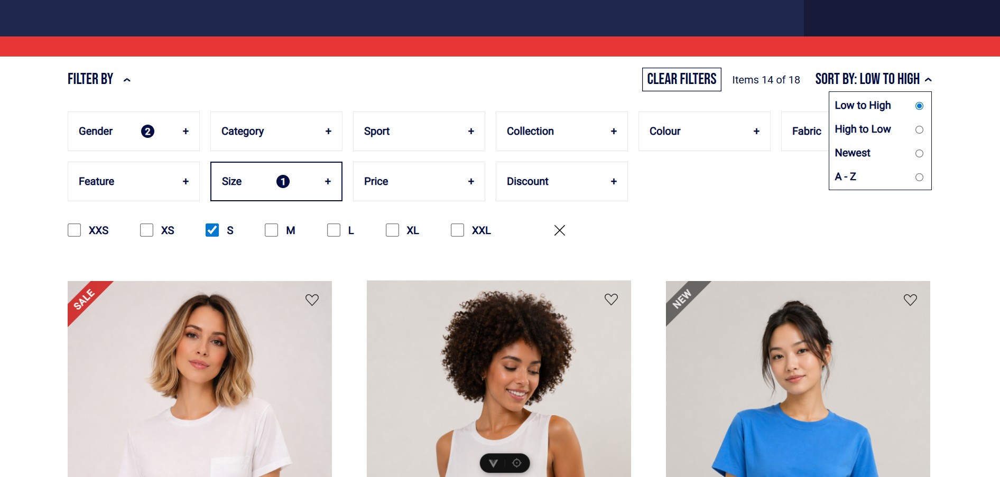

# Vue-Commerce Filter Engine

A high-performance, reactive product listing interface built with **Vue 3**. This project demonstrates advanced state management across multiple sibling components to create a seamless "Faceted Search" experience.

 

## Key Features

*   **Faceted Search Logic:** Sophisticated filtering system using **OR** logic within categories (e.g., multiple sizes) and **AND** logic between categories (e.g., Gender + Color).
*   **Reactive State Management:** Real-time synchronization of filter badges, selection counts, and active UI states across a "Star" component architecture.
*   **Smart Sorting:** Dynamic sorting (Price: Low/High, Newest, A-Z) that intelligently handles both standard and discounted sale prices.
*   **Zero-Layout-Shift UI:** Custom-built components using CSS `inset box-shadow` techniques to prevent UI jumping during state changes.
*   **Product Tagging:** Visual indicators for "SALE" and "NEW" items driven by a flexible attribute-based data seeder.

## Tech Stack

*   **Framework:** Vue 3 (Composition API)
*   **Styling:** SCSS / Flexbox
*   **Icons:** Custom SVG components
*   **Data:** Local JSON-based seeder with attribute-mapping

## Installation & Setup

1. **Clone the repository:**
   ```bash
   git clone https://github.com/AleksandrSamusev/Vue3-Commerce-Filters.git
   cd Vue3-Commerce-Filters

2. **Install dependencies:**
   ```bash
   npm install

3. **Install dependencies:**
   ```bash
   npm run dev

4. **Build for production:**
   ```bash
   npm run build